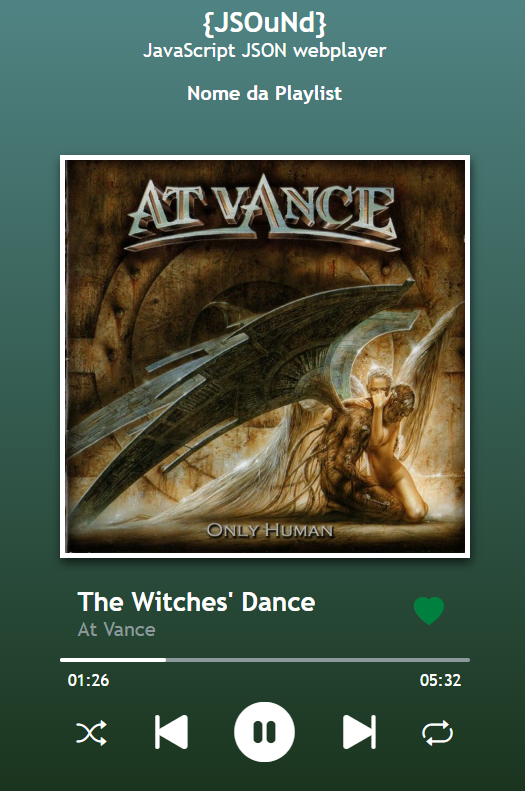

# {JSOuNd} 🎵  
**JavaScript JSON Webplayer**
[🎧 Run {JSOuNd}](https://brunoaraujosoares.github.io/JSOuNd/)

{JSOuNd} is a simple and elegant music web player built with **HTML**, **CSS**, and **JavaScript**, using **JSON** to manage the playlist and **localStorage** to persist user data.  

## 🎯 Features
- **Play / Pause** control  
- **Next / Previous** track navigation  
- **Shuffle** (random order)  
- **Repeat** (track looping)  
- **Like** button with persistence in browser  
- **Interactive progress bar**  
- **Keyboard shortcuts**:  
  - `Space` → Play / Pause  
  - `→` → Next track  
  - `←` → Previous track  

## 🖼️ Interface Preview
Add a screenshot of the player interface here:  

  

## 📂 Project Structure
```plaintext
/
├── index.html          # Main player structure
├── style.css           # Player styling
├── script.js           # Player logic (playlist, events, etc.)
├── album_covers/       # Album cover images
└── music/              # Audio files (.mp3)

